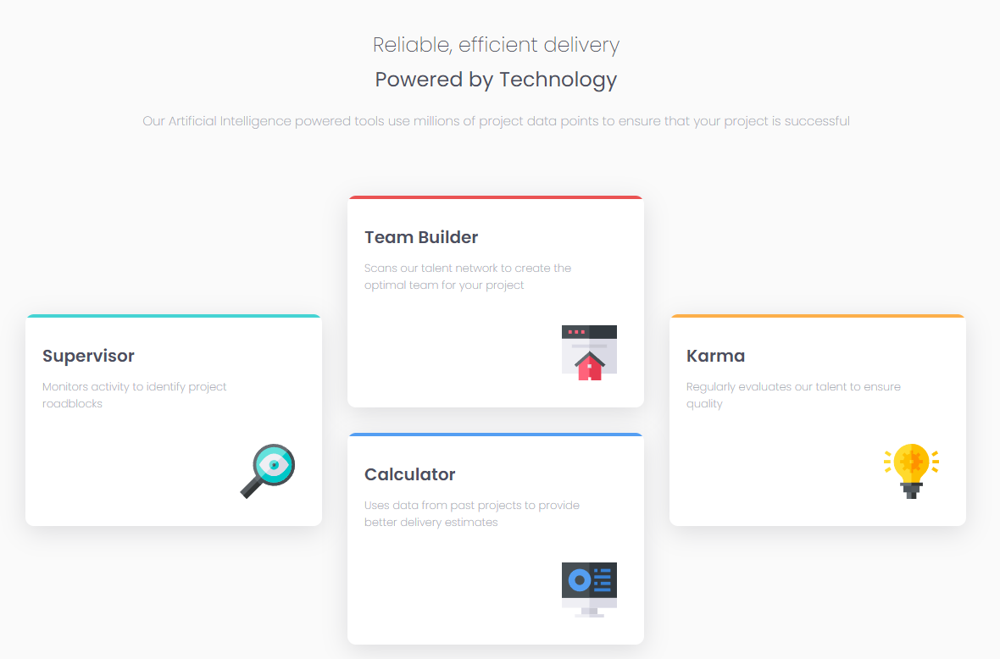

# Frontend Mentor - Four card feature section solution

This is a solution to the [Four card feature section challenge on Frontend Mentor](https://www.frontendmentor.io/challenges/four-card-feature-section-weK1eFYK). Frontend Mentor challenges help you improve your coding skills by building realistic projects. 

## Table of contents

- [Overview](#overview)
  - [The challenge](#the-challenge)
  - [Screenshot](#screenshot)
  - [Links](#links)
- [My process](#my-process)
  - [Built with](#built-with)
- [Author](#author)

## Overview

### The challenge

Users should be able to:

- View the optimal layout for the site depending on their device's screen size

### Screenshot

### Links

- [Solution URL ](https://github.com/BMcdavitt/femFourCardFeatureSection/tree/master)
- [Live Site URL ](https://bmcdavitt.github.io/femFourCardFeatureSection/)

## My process

### Built with

- Semantic HTML5 markup
- CSS custom properties
- CSS Grid
- Mobile-first workflow
- [React](https://reactjs.org/) - JS library

## Author

- Website - [Bill McDavitt](https://bmcdavitt.github.io/homepage/)
- Frontend Mentor - [@yourusername](https://www.frontendmentor.io/profile/BMcdavitt)
- Twitter - [@yourusername](https://twitter.com/bill_mcdavitt)

**Note: Delete this note and add/remove/edit lines above based on what links you'd like to share.**

